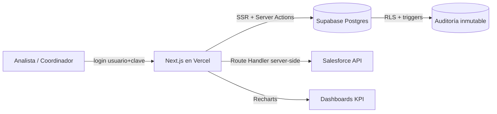
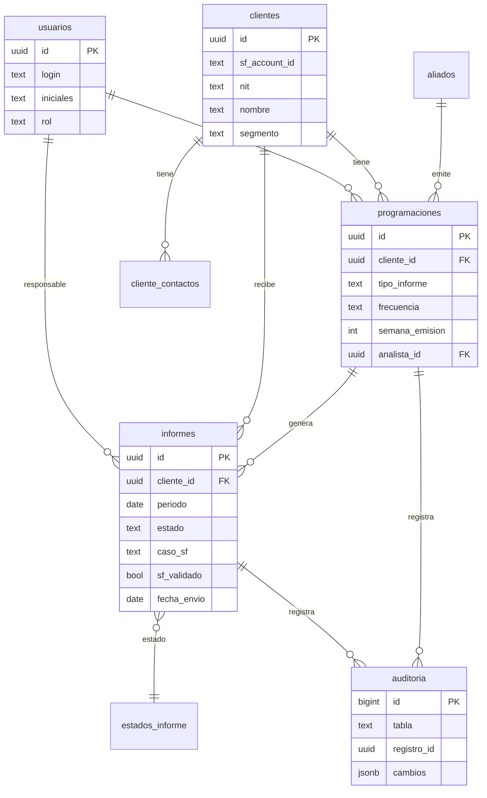

# Reporting Desk — Arquitectura

> Sistema para gestionar el **inventario y la programación de informes** que ETB
> envía a sus clientes, medir la **productividad y el cumplimiento** de cada
> analista, **validar contra Salesforce** que cada informe tenga un caso real, y
> conservar un **historial inmutable** de todo lo que pasa. Reemplaza el manejo
> por Excel. Es un **proyecto nuevo** (no es una modificación de Pulso; reutiliza
> su stack y patrones probados).

---

## 1. Análisis de los archivos fuente

### 1.1 `Inventario_y_Programación_Informes (Reporting Desk).xlsx`

Es el archivo maestro. Contiene, en la práctica, tres cosas mezcladas:

| Hoja | Filas | Qué es | Rol en el sistema |
|---|---|---|---|
| `CLIENTES_SF` | ~18.547 | Export de cuentas de **Salesforce** (`Name`, `Id`, `Segmento__c`, `SubSegmento__c`, `ValordeCliente__c`, `AccountNumber`=NIT, `Ingeniero_Posventa__c`…) | **Maestro de clientes** (fuente de verdad) → tabla `clientes` |
| `CALENDARIO_<MES>` (oct…abr) | ~18.577 c/u | La **programación** por mes: una fila por cliente con `Tipo de Informe`, `Frecuencia`, `Semana de Emisión`, `Analista`, `Area emite`, `Estado`, `Caso SF`, `Fecha de Envío` | **Programación + informes** → `programaciones` / `informes` |
| `CONTACTOS_CLIENTES` | ~18.495 | NIT, ejecutivo, contactos | → `cliente_contactos` |
| `BASE_ALIADOS_SUPS` | — | Contratos con **aliados** que emiten informes (supervisor, objeto, fechas) | → `aliados` |
| `BASE_ING_POS_CONTRATOS` | — | Mapa ingeniero-posventa por cuenta | enriquece `clientes` |
| `Resumen`, `Tabla_Semana_*`, `Analisis_*` | — | Tablas dinámicas (Analista × Estado) | Se reemplazan por **vistas KPI** |
| `CALENDARIO_BUZONES` | — | Rotación de buzones por semana/analista | Config. de asignación (fase 2) |

**Hallazgo clave:** de las ~18.577 filas por mes, solo **~560 son informes
realmente programados**; el resto son clientes en estado *"Sin Programación"*
(el universo completo). Es decir: el Excel mezcla el **catálogo de clientes**
con la **operación del mes**. El sistema los separa.

**Dimensiones reales encontradas (abril):**

- **Estado:** `Sin Programación` (17.986) · `Enviado` (556) · `Enviado posventa` (28) · `Enviado Parcial - Pdte Info Aliado` (6) · `Programado` (1)
- **Analista (iniciales):** GA, FD, YM, CU, LR, KM, TS, AM (+ DP, YM…)
- **Frecuencia:** Mensual · Semanal · N/A
- **Semana de Emisión:** Semana 1 a 5
- **Área emite:** Reporting · InformesHdp · Posventa
- **Segmento:** Empresas (12.489) · Gobierno (4.664) · Mayoristas (1.381)
- **Tipo de Informe:** Estandar · Estandar 2 · Especial · Consumo LTE · Informe Aliado
- **Caso SF:** número de caso informativo (p.ej. `26623524`) → se valida en Salesforce.

### 1.2 `LIBRO_CONSULTA_CLIENTES.xlsx`

Es la **ficha operativa** por cliente, más manual:

- `INFO CLIENTES`: `POSTVENTA`, `Nit`, `Nombre`, `TIPO` (A/E/P/N/A), `INFORME - CARACTERISTICAS`, `ANS`, `CONTACTOS`, `SUPERVISOR`, `SEMANA`, `FECHA ENVIO`, `RESPONSABLE` (iniciales).
- `INFORMES ENVIADOS`, `STATUS` (empalme/información recibida), `DISTRIBUCIÓN`, `CONTROL INFORMACION`: conteos y estados de empalme de contratos.

**Rol en el sistema:** enriquece `clientes` (supervisor, ANS) y aporta el detalle
de "características del informe". El importador `import:consulta` empata por NIT.

### 1.3 Conclusión del análisis

El ecosistema hoy vive en dos Excel que se pisan: el mismo cliente aparece con
datos distintos en cada uno, no hay control de quién cambió qué, y las métricas
se rehacen a mano cada semana con tablas dinámicas. Reporting Desk normaliza esto
en **un modelo relacional único** con Salesforce como fuente de clientes/casos.

---

## 2. Objetivos del sistema

1. **Gestionar la programación desde la app** (no desde Excel): quién envía qué,
   a qué cliente, en qué semana, con qué frecuencia.
2. **Medir productividad y "estar al día"**: enviados vs programados por analista,
   por segmento, por área — al estilo Pulso.
3. **Validar contra Salesforce**: cada informe crea un *caso informativo*; el
   sistema consulta el caso, trae el **nombre del cliente** y **comprueba que sea real**.
4. **Historial inmutable**: nadie modifica el pasado sin dejar rastro (auditoría).
5. **Dashboards tipo Power BI**: gráficas para ver el estado de un vistazo.
6. **Usuarios y roles**: analistas, coordinación, superadmin, consulta.

---

## 3. Stack y despliegue

Mismo stack probado de **Pulso** (para no reinventar y aprovechar lo ya resuelto):

```
Next.js 15 (App Router, React 19)  ──►  Vercel
        │
        ├── @supabase/ssr  (auth por cookies, middleware)
        │
Supabase (PostgreSQL + Auth + RLS + Vault)
        │
        └── Salesforce  (login SOAP usuario+contraseña+token → REST SOQL)
```

- **Frontend + backend**: Next.js en Vercel. Server Actions para lo sensible.
- **Base de datos y auth**: Supabase (Postgres). Row Level Security en todas las tablas.
- **Salesforce**: `lib/salesforce.ts` (login SOAP con `SF_USERNAME`/`SF_PASSWORD`/`SF_TOKEN`)
  + `lib/sfCaso.ts` (consulta `Case` por `CaseNumber`). Idéntico a Pulso/mayoristas-tracker.
- **Gráficas**: Recharts.



---

## 4. Modelo de datos



**Separación central:**

- **`programaciones`** = el *plan* estable (qué cliente recibe qué informe, con qué
  frecuencia, quién lo tiene). Cambia poco.
- **`informes`** = la *transacción* mensual (una fila por informe-período con su
  estado, su caso SF y su fecha de envío). De aquí salen **todas** las métricas.

Una función RPC, `generar_periodo('2026-05-01')`, crea los informes del mes a
partir de la programación activa (idempotente). Así el analista empieza el mes con
su bandeja lista, y ya no se copia/pega un Excel.

Ver el detalle en `supabase/01_schema.sql`.

---

## 5. Roles, seguridad e historial

### Roles

| Rol | Puede |
|---|---|
| **analista** | Ver toda la programación; **editar solo sus** informes (marcar enviado, pegar caso SF). No borra, no toca lo ajeno. |
| **coordinador** | Todo lo anterior + armar la programación, generar el período, reasignar, ver dashboards completos. |
| **superadmin** | + gestionar usuarios y catálogos, importar. |
| **consulta** (gerencial) | Solo lectura de dashboards. |

Implementado con **RLS** (`supabase/03_rls.sql`) y funciones `mi_rol()` /
`es_privilegiado()` / `es_admin()` (`SECURITY DEFINER`, sin recursión).

### Historial inmutable (el requisito "que no modifiquen nada")

Toda escritura en `informes` y `programaciones` dispara el trigger `fn_auditar()`
(`supabase/05_auditoria.sql`), que guarda en la tabla `auditoria`:

- qué tabla y qué fila,
- la acción (INSERT/UPDATE/DELETE),
- **quién** (su `auth.uid()` + iniciales),
- **cuándo**,
- el **diff campo por campo** (`{ estado: {antes:'programado', despues:'enviado'} }`),
- y la fila completa antes/después.

La tabla `auditoria` **no tiene políticas de escritura**: ninguna sesión puede
insertar, editar ni borrar ahí; solo el trigger (SECURITY DEFINER) escribe. Y los
`informes` **no se pueden borrar** (`inf_delete … using (false)`): si un informe
se anula, se marca por estado, no desaparece. Resultado: una caja negra auditable.

---

## 6. Integración con Salesforce

Cuando un analista marca un informe como enviado y pega su **Caso SF**, la Server
Action `registrarEnvio()` (`app/actions.ts`):

1. Consulta el caso en Salesforce (`consultarCasos([caso])`) → devuelve `Account.Name`,
   `Status`, `Owner`…
2. Compara el **nombre del cliente del informe** con el `Account.Name` del caso
   (normalizado). Si coinciden → `sf_validado = true` ("es un caso real y del cliente correcto").
3. Guarda `sf_cliente`, `sf_estado`, `sf_validado` y cachea la respuesta en
   `sf_casos_cache` para auditoría y para no repetir llamadas.

Si Salesforce no está disponible, el envío se registra igual (sin validar) — la
validación es *best-effort* y queda pendiente de re-consulta. La vista
`v_control_casos_sf` muestra cuántos enviados tienen caso real vs. caso inválido
vs. sin caso: un **control de calidad** que hoy no existe.

> Las credenciales SF viven **solo en el servidor** (variables de entorno de
> Vercel). Nunca llegan al navegador.

---

## 7. Dashboards (capa "Power BI")

Vistas SQL (`supabase/06_vistas_kpi.sql`) + RPC (`07_rpc.sql`) que Recharts consume:

| Vista / RPC | Gráfica |
|---|---|
| `resumen_periodo()` | KPIs del encabezado (total, enviados, pendientes, % cumplimiento, casos válidos) |
| `v_productividad_analista` | Barras: enviados por analista |
| `v_estado_periodo` | Dona: distribución por estado (con colores del catálogo) |
| `v_cumplimiento_segmento` | Barras: % cumplimiento por segmento |
| `v_control_casos_sf` | Control de casos Salesforce (válido / inválido / sin caso) |
| `v_tendencia_mensual` | Línea: envíos mes a mes |

`components/Dashboard.tsx` ya implementa los primeros. Las gráficas siguen una
paleta accesible y un solo eje por gráfico (sin dobles ejes).

---

## 8. Migración de los dos Excel

Tres importadores idempotentes (`scripts/`, corren con la service role key):

```bash
# 1) Maestro de clientes (Salesforce export)
npm run import:clientes    -- ./Inventario.xlsx CLIENTES_SF

# 2) Programación e informes de un mes (repetir por cada CALENDARIO_<MES>)
npm run import:programacion -- ./Inventario.xlsx CALENDARIO_ABRIL 2026-04

# 3) Enriquecer con la ficha operativa (supervisor, ANS)
npm run import:consulta     -- ./LIBRO_CONSULTA_CLIENTES.xlsx "INFO CLIENTES"
```

- `import:programacion` **ignora las filas "Sin Programación"** (migra solo los
  ~560 informes reales del mes), empata el cliente por Id SF o NIT y el analista
  por iniciales, y traduce `Estado` y `Semana de Emisión` a los códigos del catálogo.
- Reporta filas sin cliente o con analista no registrado, para depurar la carga.

Cargando cada `CALENDARIO_<MES>` se reconstruye el **histórico** de oct-2025 a
abr-2026, base inmediata para la tendencia y los comparativos.

---

## 9. Roadmap por fases

| Fase | Alcance | Estado |
|---|---|---|
| **0 · Cimientos** | Esquema, RLS, auth, roles, auditoría, dashboards base, importadores | **Hecho** |
| **1 · Operación** | Bandeja del analista (marcar enviado + caso SF con validación en vivo), generar período, editor de programación | **Hecho** |
| **2 · Gestión** | Reasignación, rotación de buzones (`CALENDARIO_BUZONES`), alertas de atraso, metas por analista/segmento | — |
| **3 · Analítica** | Más vistas Power BI (aliados, cumplimiento por semana, SLA/ANS), export | — |
| **4 · Automatización** | Sync programado de clientes desde Salesforce (cron), notificaciones push (PWA como Pulso) | — |

---

## 10. Estructura del proyecto

```
reporting-desk/
├── app/
│   ├── layout.tsx · page.tsx            Shell + gate por rol
│   ├── login/                           Login (usuario+clave) + reset
│   ├── auth/callback/route.ts           Retorno de enlaces de correo
│   └── actions.ts                       Server Actions (envío+validación SF, generar período, usuarios)
├── components/Dashboard.tsx             Tablero KPI (Recharts)
├── lib/
│   ├── supabase/{client,server,admin}.ts  Clientes browser / SSR / service-role
│   ├── salesforce.ts · sfCaso.ts        Integración Salesforce (SOAP login + SOQL)
│   ├── loginEmail.ts · types.ts         Utilidades y tipos del dominio
├── supabase/                            Migraciones SQL en orden 01→07
│   ├── 01_schema · 02_functions · 03_rls · 04_seed_catalogo
│   ├── 05_auditoria · 06_vistas_kpi · 07_rpc
├── scripts/                             Importadores de los 2 Excel
├── middleware.ts                        Protege rutas / refresca sesión
└── .env.example                         Variables (Supabase + Salesforce)
```

Ver `README.md` para el paso a paso de puesta en marcha.
